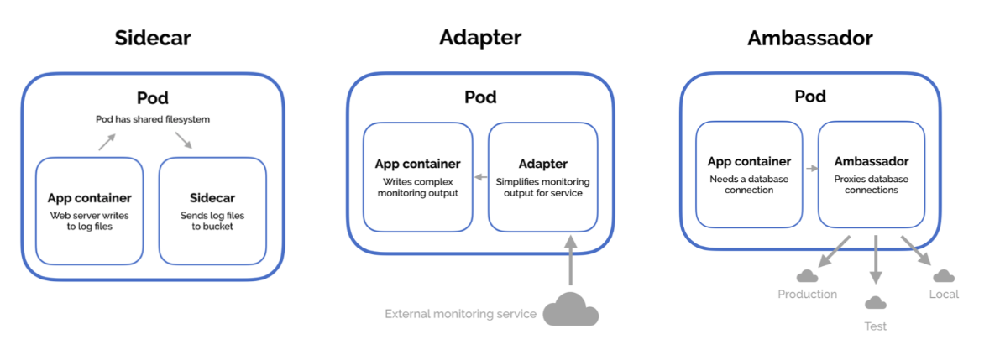

# Overview

Kubernetes는 컨테이너(Container)라는 기술을 관리하는 도구입니다. 컨테이너는 애플리케이션을 실행하는 작은 박스라고 생각하면 됩니다. 여러 개의 컨테이너가 모이면 관리하기가 어려워지는데, Kubernetes가 이를 자동으로 배치하고 운영하는 역할을 합니다.

---
## Pod
Pod란 컨테이너 그룹의 스케줄링과 배포, 격리된 런타임에 대한 최소 단위이다.
- 하나의 Pod 안에는 하나 이상의 컨테이너가 포함될 수 있음.
- Pod은 컨테이너들의 동일 장소 배치를 보장한다. 동일 장소 보장 덕분에 컨테이너 들은 서로 데이터 교환을 할수 있다.
- 컨테이너들은 같은 호스트에 의해 스케줄링, 배포되고 같은 네트워크와 저장소를 공유
- 컨테이너들은 하나의 IP 주소와 이름, 포트 범위를 갖는다.


> 기본적으로 Pod에는 한개의 컨테이너가 이상적이지만 특정 경우에서는 유용한 경우가 있다. 아래 그림으로 예시 제공.
> (트러블 슈팅 용도로도 많이 사용하는 것 같다.)


---
## Service

Service는 네트워크를 통해 Pod들에 안정적으로 접근할 수 있도록 도와주는 역할을 합니다.

쿠버네티스에서 Pod은 영구적인 상태값을 유지하지 않고 변경될 수 있고 같은 애플리케이션이라도 IP가 변경되는 경우가 있음. 따라서 서비스는 고정된 네트워크(고유 IP, DNS) 제공하여 통신을 안정적으로 할 수 있도록 함.
- 동적인 IP 변경 문제 해결
- 로드 밸런싱
- 내부 및 외부 접근 제어
- 서비스 디스커버리

### ClusterIP 
내부 통신 용도

```yaml
# 같은 클러스터 안의 다른 파드에서 my-service 이름으로 접근 가능
# curl http://my-service:80
apiVersion: v1
kind: Service
metadata:
  name: my-service
spec:
  selector:
    app: my-app
  ports:
    - protocol: TCP
      port: 80       # 서비스에서 사용하는 포트
      targetPort: 8080 # 파드에서 실행 중인 포트
  type: ClusterIP  # 클러스터 내부에서만 접근 가능
```

### NodePort
외부에서 접근 가능

```yaml
# 클러스터 외부에서 노드IP:30007로 접근 가능
# http://<노드IP>:30007
apiVersion: v1
kind: Service
metadata:
  name: my-service
spec:
  selector:
    app: my-app
  ports:
    - protocol: TCP
      port: 80
      targetPort: 8080
      nodePort: 30007  # 노드에서 외부로 개방할 포트
  type: NodePort  # 외부에서 접근 가능
```

### LoadBalancer

```yaml
# 클라우드(AWS, GCP, Azure)의 로드 밸런서를 통해 트래픽을 자동으로 분배
# http://<클라우드 로드 밸런서 IP>
apiVersion: v1
kind: Service
metadata:
  name: my-service
spec:
  selector:
    app: my-app
  ports:
    - protocol: TCP
      port: 80
      targetPort: 8080
  type: LoadBalancer  # 클라우드 제공자의 외부 로드 밸런서 사용
```

### 주의
- 보안 설정 필수: 외부에서 접근하는 서비스(NodePort, LoadBalancer)는 보안 설정(예: 방화벽, 인증)을 고려해야 합니다.
- Ingress 활용 고려: NodePort나 LoadBalancer 대신, Ingress(웹 트래픽 라우팅)를 활용하면 더 효율적입니다.

---
## Label

Label은 k8s의 객체(Pod, Servie, Deployment)의 Key-Value 형태의 Metadata이다.
> k8s에서 리소스를 쉽게 식별하고 그룹화 하는데 사용.

### 사용 주요 기능
1. 필터링: 특정 있는 리소스만 조회 가능
2. 서비스 연결: 특정 Pod만 서비스 연결 가능
3. 운영 관리: 배포, 롤링 업데이트, 모니터링 등 사용

```sh
# 필터링 조회 
kubectl get pods -l app=web,env=production
```

### 주의
- 유지보수 목적으로 공통 레이블을 미리 정의한 후 사용하는게 좋음
